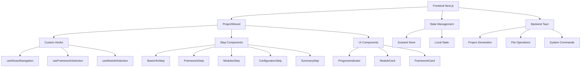

Guide de Développement: ArchiTech POC avec Next.js & Tauri
1. Vision et Contexte du Projet
À Propos d'ArchiTech
ArchiTech est un générateur de frameworks nouvelle génération qui transforme fondamentalement le processus de création d'applications web. Notre objectif est de réduire le temps de configuration d'un projet de "plusieurs semaines à quelques minutes", permettant aux développeurs de se concentrer sur la création de valeur plutôt que sur la configuration technique.
Problèmes Résolus
	•	Friction technique : 60% du temps des développeurs est perdu en configuration plutôt qu'en création
	•	Déconnexion design-code : Les équipes luttent pour maintenir la cohérence entre design et implémentation
	•	Réinvention constante : Les équipes réimplémentent continuellement des solutions à des problèmes déjà résolus
	•	Barrière à l'innovation : La complexité technique limite qui peut créer des applications significatives
Vision du Produit
Notre POC représente la première étape vers un système auto-évolutif qui apprend, s'adapte et évolue avec ses utilisateurs, éliminant les frontières artificielles entre l'idéation et l'implémentation.

## Approche Framework-First

ArchiTech adopte une approche "framework-first" plutôt qu'une approche basée sur des templates. Cette distinction est fondamentale car elle permet une génération plus précise et personnalisée:

- **Frameworks au lieu de Templates**: Au lieu d'offrir des templates prédéfinis avec du code potentiellement inutilisé, nous proposons de choisir un framework de base (Next.js, Vite, Tauri, etc.) puis de le personnaliser avec des modules.

- **Génération à la demande**: Chaque projet est généré exactement selon les besoins spécifiés, sans code superflu.

- **Modularité maximale**: Les modules peuvent être combinés librement tant qu'ils sont compatibles avec le framework sélectionné.

- **Évolutivité**: Cette approche permet d'ajouter facilement de nouveaux frameworks et modules sans restructurer l'application.

## Approche "Command Line First" (Nouveauté)

ArchiTech a évolué vers une approche "Command Line First" qui présente des avantages significatifs:

- **Toujours à jour**: En utilisant directement les outils CLI officiels (`create-next-app`, etc.), nous garantissons que les projets générés utilisent toujours les versions les plus récentes des frameworks et bibliothèques.

- **Maintenance réduite**: Pas besoin de mettre à jour constamment des fichiers templates lorsque les outils sous-jacents changent.

- **Empreinte minimale**: Réduction drastique de la taille de l'application en éliminant les assets statiques.

- **Plus flexible**: Les outils CLI offrent souvent des options de configuration robustes qui peuvent être composées programmatiquement.

- **Support officiel**: L'utilisation des outils CLI officiels assure la compatibilité et le respect des meilleures pratiques.

Cette approche se base sur une structure de données JSON qui décrit:
1. Les commandes CLI à exécuter
2. Les arguments et options à passer
3. Les opérations de fichiers post-installation nécessaires

### Structure des données

```
/data
  /frameworks    # Descriptions des frameworks et leurs commandes CLI
    web.json     # Frameworks web (Next.js, Vite, etc.)
    app.json     # Frameworks mobiles
    desktop.json # Frameworks desktop
  /modules
    modules.json # Tous les modules avec leurs commandes d'installation et modifications
```

### Architecture d'exécution

Le système utilise:
1. Un exécuteur de commandes avancé qui gère les CLI interactives et non-interactives
2. Des utilitaires de transformation de fichiers pour les opérations post-installation
3. Une gestion intelligente des dépendances entre modules

2. Environnement de Développement
Prérequis Techniques
	•	Node.js (v18+)
	•	Rust (édition 2021+)
	•	Git
	•	VS Code (recommandé avec extensions Tauri et React)
Initialisation du Projet

# Cloner le template avec configuration Tailwind et DaisyUI
git clone [URL_REPO_TEMPLATE] architech
cd architech

# Installer les dépendances
npm install

# Démarrer en mode développement
npm run tauri dev

Structure de Projet Optimisée

architech/
├── src/                        # Code Next.js
│   ├── app/                    # Routage App Router
│   │   ├── layout.tsx          # Layout principal
│   │   ├── page.tsx            # Page d'accueil
│   │   └── (sections)/         # Routes groupées par section
│   │       ├── project-wizard/ # Assistant de création de projet
│   │       ├── frameworks/     # Navigateur de frameworks
│   │       └── settings/       # Paramètres application
│   │
│   ├── components/             # Composants React
│   │   ├── ui/                 # Composants de base (avec shadcn/ui)
│   │   ├── features/           # Composants spécifiques aux fonctionnalités  
│   │   └── wizard/             # Composants de l'assistant de création
│   │
│   ├── lib/                    # Logique métier
│   │   ├── store/              # État global (Zustand)
│   │   ├── services/           # Services d'abstraction
│   │   │   ├── framework-service.ts  # Gestion des frameworks
│   │   │   ├── project-service.ts   # Génération de projets
│   │   │   └── system-service.ts    # Opérations système
│   │   │
│   │   ├── types/              # Types TypeScript partagés
│   │   ├── constants/          # Constantes et configuration
│   │   └── utils/              # Utilitaires
│   │
│   └── styles/                 # Styles globaux (Tailwind + DaisyUI)
│
├── src-tauri/                  # Code Rust (backend Tauri)
│   ├── src/
│   │   ├── main.rs             # Point d'entrée Rust
│   │   ├── commands.rs         # Commandes exposées au frontend
│   │   ├── generator/          # Logique de génération
│   │   └── utils.rs            # Utilitaires Rust
│   │
│   ├── Cargo.toml              # Configuration Rust
│   └── tauri.conf.json         # Configuration Tauri
│
└── modules/                # Définitions des modules
    └── modules.json        # Tous les modules disponibles

3. Architecture Technique Spécifique

### Custom Hook Architecture

Notre application utilise une architecture basée sur des hooks personnalisés pour une meilleure gestion d'état et une meilleure réutilisabilité du code :

  const [visitedSteps, setVisitedSteps] = useState<Set<number>>(new Set([0]));
  const [isCompleted, setIsCompleted] = useState(false);

  const goToNextStep = () => {
    if (currentStepIndex < steps.length - 1) {
      setCurrentStepIndex(prev => prev + 1);
      setVisitedSteps(prev => new Set([...prev, currentStepIndex + 1]));
    }
  };

  // ... autres fonctions de navigation ...
}
```

### Système d'Animation

Nous avons implémenté un système d'animation robuste utilisant des keyframes CSS et des classes utilitaires :

```css
/* Animations globales */
@keyframes fadeIn {
  from { opacity: 0; }
  to { opacity: 1; }
}

@keyframes slideUp {
  from { transform: translateY(20px); opacity: 0; }
  to { transform: translateY(0); opacity: 1; }
}

@keyframes slideIn {
  from { transform: translateX(-20px); opacity: 0; }
  to { transform: translateX(0); opacity: 1; }
}
```

### Flux du Wizard Amélioré

Le wizard de création de projet a été restructuré pour offrir une meilleure expérience utilisateur :

1. **Gestion d'État Isolée**
   - Chaque étape gère son propre état via des hooks personnalisés
   - État global géré via Zustand pour la persistance

2. **Navigation Intelligente**
   - Validation des étapes avant progression
   - Historique des étapes visitées
   - Indicateurs de progression visuels

3. **Composants Modulaires**
   - Chaque étape est un composant indépendant
   - Réutilisation des composants UI de base
   - Animations fluides entre les étapes

### Structure des Composants

```typescript
// Structure recommandée pour les composants du wizard
src/components/wizard/
├── hooks/                    # Hooks personnalisés
│   ├── useWizardNavigation.ts
│   ├── useFrameworkSelection.ts
│   └── useModuleSelection.ts
├── steps/                    # Composants d'étape
│   ├── BasicInfoStep.tsx
│   ├── FrameworkStep.tsx
│   ├── ModulesStep.tsx
│   ├── ConfigurationStep.tsx
│   └── SummaryStep.tsx
├── ui/                       # Composants UI réutilisables
│   ├── ProgressIndicator.tsx
│   ├── ModuleCard.tsx
│   └── FrameworkCard.tsx
└── ProjectWizard.tsx         # Composant principal
```

### Bonnes Pratiques de Développement

1. **Gestion d'État**
   - Utiliser des hooks personnalisés pour la logique métier
   - Isoler l'état local des composants
   - Utiliser Zustand pour l'état global partagé

2. **Performance**
   - Implémenter le lazy loading pour les composants lourds
   - Utiliser React.memo pour les composants purs
   - Optimiser les re-rendus avec useMemo et useCallback

3. **Accessibilité**
   - Utiliser des rôles ARIA appropriés
   - Gérer le focus pour la navigation au clavier
   - Fournir des alternatives textuelles

4. **Tests**
   - Tester les hooks personnalisés avec @testing-library/react-hooks
   - Tester les composants avec @testing-library/react
   - Tester les animations avec @testing-library/jest-dom

Interface Frontend/Backend
1. Commandes Tauri
Exposer les fonctionnalités Rust au frontend via les commandes Tauri:

// src-tauri/src/commands.rs
#[tauri::command]
fn get_frameworks() -> Result<Vec<Framework>, String> {
    // Lire et retourner les frameworks disponibles
}

#[tauri::command]
fn get_modules() -> Result<Vec<Module>, String> {
    // Lire et retourner les modules disponibles
}

#[tauri::command]
fn generate_project(config: ProjectConfig) -> Result<ProjectResult, String> {
    // Générer un projet selon la configuration fournie
}

2. Couche Service Next.js

// src/lib/services/framework-service.ts
import { invoke } from '@tauri-apps/api/tauri';
import type { Framework, Module, ProjectConfig, ProjectResult } from '../types';

// Interface qui sera compatible avec une future implémentation backend
export interface FrameworkServiceInterface {
  getFrameworks(): Promise<Framework[]>;
  getModules(): Promise<Module[]>;
  generateProject(config: ProjectConfig): Promise<ProjectResult>;
}

// Implémentation Tauri (locale)
export class TauriFrameworkService implements FrameworkServiceInterface {
  async getFrameworks(): Promise<Framework[]> {
    return await invoke('get_frameworks');
  }
  
  async getModules(): Promise<Module[]> {
    return await invoke('get_modules');
  }
  
  async generateProject(config: ProjectConfig): Promise<ProjectResult> {
    return await invoke('generate_project', { config });
  }
}

// Factory pour obtenir l'implémentation appropriée
export function getFrameworkService(): FrameworkServiceInterface {
  return new TauriFrameworkService();
}

3. Gestion d'État avec Zustand

// src/lib/store/project-store.ts
import { create } from 'zustand';
import { getFrameworkService } from '../services/framework-service';

const frameworkService = getFrameworkService();

interface ProjectState {
  frameworks: Framework[];
  modules: Module[];
  selectedFramework: string | null;
  selectedModules: string[];
  projectConfig: Partial<ProjectConfig>;
  isLoading: boolean;
  error: string | null;
  
  // Actions
  fetchFrameworks: () => Promise<void>;
  fetchModules: () => Promise<void>;
  selectFramework: (frameworkId: string) => void;
  toggleModule: (moduleId: string) => void;
  updateProjectConfig: (config: Partial<ProjectConfig>) => void;
  generateProject: () => Promise<ProjectResult>;
}

export const useProjectStore = create<ProjectState>((set, get) => ({
  frameworks: [],
  modules: [],
  selectedFramework: null,
  selectedModules: [],
  projectConfig: {},
  isLoading: false,
  error: null,
  
  fetchFrameworks: async () => {
    set({ isLoading: true, error: null });
    try {
      const frameworks = await frameworkService.getFrameworks();
      set({ frameworks, isLoading: false });
    } catch (error) {
      set({ error: String(error), isLoading: false });
    }
  },
  
  // Autres actions...
  
  generateProject: async () => {
    const { projectConfig, selectedFramework, selectedModules } = get();
    set({ isLoading: true, error: null });
    
    try {
      const config = {
        ...projectConfig,
        frameworkId: selectedFramework,
        moduleIds: selectedModules,
      } as ProjectConfig;
      
      const result = await frameworkService.generateProject(config);
      set({ isLoading: false });
      return result;
    } catch (error) {
      set({ error: String(error), isLoading: false });
      throw error;
    }
  }
}));

4. Flux de Développement
Phase 1: Fondation (Semaine 1) ✅
Objectifs
	•	Configuration du framework Tauri avec Next.js ✅
	•	Structuration de l'interface utilisateur de base ✅
	•	Mise en place de la communication frontend/backend ✅

Phase 2: Core Generator (Semaine 2) ✅
Objectifs
	•	Implémentation de la logique de génération de projet en Rust ✅
	•	Structure des templates et modules ✅
	•	Manipulation de fichiers et exécution de commandes ✅

Phase 3: Assistant de Création (Semaine 3) 🔄
Objectifs
	•	Développement de l'assistant de création de projet en plusieurs étapes 🔄
	•	Intégration complète avec la logique de génération 🔄
	•	Interface utilisateur riche et réactive ✅

Phase 4: Modules et Templates (Semaine 4) 🔄
Objectifs
	•	Implémentation des modules spécifiques 🔄
	•	Création des templates spécialisés 🔄
	•	Tests et validation du processus complet 🔄

Phase 5: Finition (1 semaine supplémentaire si nécessaire)
Objectifs
	•	Amélioration de l'expérience utilisateur
	•	Correction des problèmes identifiés
	•	Préparation de la démo
Tâches
	1.	Polissage UI/UX [2j]
	▪	Affiner les transitions et animations
	▪	Améliorer les états de chargement et retours visuels
	▪	Optimiser pour différentes tailles d'écran
	2.	Tests et Corrections [2j]
	▪	Tests sur différents systèmes d'exploitation
	▪	Correction des bugs identifiés
	▪	Optimisations de performance
	3.	Préparation de la Démo [1j]
	▪	Créer des scénarios de démonstration
	▪	Préparer des projets exemple
	▪	Documenter les fonctionnalités clés
5. Implémentation des Fonctionnalités Clés
Générateur de Projet
Implémentation Rust
Le cœur du générateur utilise:
	1.	L'exécution de ⁠create-next-app avec les options appropriées
	2.	L'application séquentielle des modules sélectionnés
	3.	Des opérations de fichiers pour ajouter/modifier le code

// src-tauri/src/generator/mod.rs
pub fn generate_project(config: ProjectConfig) -> Result<(), String> {
    // 1. Créer le projet de base avec create-next-app
    let cmd_result = create_base_project(&config)?;
    
    // 2. Appliquer la structure de dossiers imposée
    enforce_project_structure(&config.path)?;
    
    // 3. Appliquer les modules séquentiellement
    for module_id in &config.module_ids {
        apply_module(&config.path, module_id)?;
    }
    
    // 4. Configuration finale et nettoyage
    finalize_project(&config.path)?;
    
    Ok(())
}

fn create_base_project(config: &ProjectConfig) -> Result<(), String> {
    // Construire la commande create-next-app avec les options appropriées
    let mut cmd = Command::new("npx");
    cmd.arg("create-next-app@latest")
       .arg(&config.name)
       .arg("--typescript")
       .current_dir(&config.parent_directory);
    
    if config.use_app_router {
        cmd.arg("--app");
    }
    
    // Exécuter la commande
    let output = cmd.output().map_err(|e| e.to_string())?;
    
    if !output.status.success() {
        return Err(format!("Failed to create project: {}", String::from_utf8_lossy(&output.stderr)));
    }
    
    Ok(())
}

Interface React pour le Wizard
Créer un assistant en plusieurs étapes avec une expérience fluide:

// src/components/wizard/ProjectWizard.tsx
import { useEffect } from 'react';
import { useWizardNavigation } from './hooks/useWizardNavigation';
import { useFrameworkSelection } from './hooks/useFrameworkSelection';
import { BasicInfoStep } from './steps/BasicInfoStep';
import { FrameworkStep } from './steps/FrameworkStep';
import { ModulesStep } from './steps/ModulesStep';
import { ConfigurationStep } from './steps/ConfigurationStep';
import { SummaryStep } from './steps/SummaryStep';
import { ProgressIndicator } from './ui/ProgressIndicator';

const steps = [
  { title: 'Informations de base', component: BasicInfoStep },
  { title: 'Framework', component: FrameworkStep },
  { title: 'Modules', component: ModulesStep },
  { title: 'Configuration', component: ConfigurationStep },
  { title: 'Résumé', component: SummaryStep },
];

export function ProjectWizard() {
  const {
    currentStepIndex,
    visitedSteps,
    progress,
    goToNextStep,
    goToPreviousStep,
    goToStep,
    canGoNext,
    canGoPrevious,
  } = useWizardNavigation(steps);

  const {
    frameworksByType,
    selectedFrameworkId,
    selectedType,
    loading: frameworksLoading,
    error: frameworksError,
    setSelectedType,
    selectFramework,
  } = useFrameworkSelection();

  const CurrentStepComponent = steps[currentStepIndex].component;

  return (
    <div className="container mx-auto py-8">
      <ProgressIndicator
        steps={steps}
        currentStepIndex={currentStepIndex}
        visitedSteps={visitedSteps}
        onStepClick={goToStep}
      />

      <div className="card bg-base-200 shadow-xl animate-fadeIn">
        <div className="card-body">
          <div className="animate-slideUp">
            <CurrentStepComponent
              onNext={goToNextStep}
              onPrevious={goToPreviousStep}
              canGoNext={canGoNext}
              canGoPrevious={canGoPrevious}
            />
          </div>
        </div>
      </div>
    </div>
  );
}

Définition de Module
Structure JSON pour définir un module:

{
  "id": "tailwind",
  "name": "Tailwind CSS",
  "description": "Framework CSS utilitaire pour un développement rapide",
  "category": "styling",
  "icon": "brush",
  "commands": {
    "install": "npm install -D tailwindcss postcss autoprefixer",
    "init": "npx tailwindcss init -p"
  },
  "files": [
    {
      "source": "tailwind/tailwind.config.js",
      "destination": "tailwind.config.js",
      "operation": "create_or_merge"
    },
    {
      "source": "tailwind/globals.css",
      "destination": "src/styles/globals.css",
      "operation": "create_if_not_exists"
    }
  ],
  "transforms": [
    {
      "type": "json",
      "target": "package.json",
      "operations": [
        {
          "path": "dependencies",
          "action": "merge",
          "value": {
            "tailwindcss": "^3.3.0"
          }
        }
      ]
    },
    {
      "type": "import",
      "target": "src/app/layout.tsx",
      "operations": [
        {
          "action": "add",
          "value": "import './globals.css'"
        }
      ]
    }
  ],
  "configuration": {
    "options": [
      {
        "id": "plugins",
        "type": "multiselect",
        "label": "Plugins Tailwind",
        "description": "Sélectionnez les plugins additionnels",
        "default": ["typography"],
        "choices": [
          {"value": "typography", "label": "Typography"},
          {"value": "forms", "label": "Forms"},
          {"value": "aspect-ratio", "label": "Aspect Ratio"}
        ]
      },
      {
        "id": "darkMode",
        "type": "select",
        "label": "Mode Sombre",
        "description": "Configuration du mode sombre",
        "default": "class",
        "choices": [
          {"value": "media", "label": "Basé sur les préférences système"},
          {"value": "class", "label": "Basé sur les classes"}
        ]
      }
    ]
  }
}

6. Tests et Assurance Qualité
Tests Automatisés
Tests React avec Vitest et Testing Library

// src/components/wizard/steps/BasicInfoStep.test.tsx
import { render, screen, fireEvent } from '@testing-library/react';
import { BasicInfoStep } from './BasicInfoStep';
import { useProjectStore } from '@/lib/store/project-store';

// Mock le store Zustand
vi.mock('@/lib/store/project-store');

describe('BasicInfoStep', () => {
  beforeEach(() => {
    vi.mocked(useProjectStore).mockReturnValue({
      projectConfig: { name: '', path: '' },
      updateProjectConfig: vi.fn(),
    } as any);
  });

  it('should update project config when form changes', () => {
    const updateProjectConfig = vi.fn();
    vi.mocked(useProjectStore).mockReturnValue({
      projectConfig: { name: '', path: '' },
      updateProjectConfig,
    } as any);

    render(<BasicInfoStep />);
    
    const nameInput = screen.getByLabelText(/nom du projet/i);
    fireEvent.change(nameInput, { target: { value: 'my-awesome-project' } });
    
    expect(updateProjectConfig).toHaveBeenCalledWith({
      name: 'my-awesome-project',
    });
  });
});

Tests Rust avec Cargo Test

// src-tauri/src/generator/tests.rs
#[cfg(test)]
mod tests {
    use super::*;
    use std::fs;
    use tempfile::tempdir;

    #[test]
    fn test_apply_module() {
        // Créer un répertoire temporaire pour les tests
        let temp_dir = tempdir().unwrap();
        let temp_path = temp_dir.path().to_str().unwrap().to_string();
        
        // Créer un projet fictif minimal
        fs::create_dir_all(format!("{}/src", temp_path)).unwrap();
        fs::write(
            format!("{}/package.json", temp_path),
            r#"{"name":"test-project","dependencies":{}}"#,
        ).unwrap();
        
        // Appliquer le module tailwind
        let result = apply_module(&temp_path, "tailwind");
        assert!(result.is_ok());
        
        // Vérifier que les fichiers ont été créés
        assert!(fs::metadata(format!("{}/tailwind.config.js", temp_path)).is_ok());
        
        // Vérifier que package.json a été mis à jour
        let package_json = fs::read_to_string(format!("{}/package.json", temp_path)).unwrap();
        assert!(package_json.contains("tailwindcss"));
    }
}

Plan de Test Manuel
Pour chaque version, tester manuellement:
	1.	Flux complet de création
	▪	Création d'un projet basique
	▪	Projet avec plusieurs modules
	▪	Projet avec toutes les options
	2.	Validation de projet
	▪	Vérifier que le projet généré démarre correctement
	▪	Tester les fonctionnalités des modules
	▪	Vérifier la structure de dossiers imposée
	3.	Tests multi-plateformes
	▪	Windows 10/11
	▪	macOS
	▪	Ubuntu Linux
7. Livraison du POC
Critères d'Acceptation
Le POC sera considéré comme réussi lorsque:
	1.	Un utilisateur peut générer un projet Next.js complet en moins de 2 minutes
	2.	Les projets générés respectent nos standards de structure et bonnes pratiques
	3.	L'application fonctionne sur Windows, macOS et Linux
	4.	Au moins 3 templates spécialisés sont disponibles
	5.	Au moins 5 modules fonctionnels sont implémentés
Démonstration
Préparer une démonstration qui met en évidence:
	1.	La rapidité du processus (chronométrer la génération vs. configuration manuelle)
	2.	La qualité des projets générés (montrer les fonctionnalités)
	3.	La flexibilité et modularité du système
	4.	La facilité d'utilisation pour les développeurs de tous niveaux
Documentation du POC
Fournir:
	1.	Un README détaillé expliquant l'installation et l'utilisation
	2.	Une documentation sur l'architecture technique
	3.	Un guide pour ajouter de nouveaux templates et modules
	4.	Un plan pour les prochaines étapes de développement
8. Prochaines Étapes
Après le POC, les développements prioritaires seront:
	1.	Backend Services
	▪	API pour templates et modules
	▪	Système d'analyse et d'amélioration continue
	▪	Authentification et personnalisation
	2.	Intelligence Avancée
	▪	Recommandations basées sur l'usage
	▪	Détection de patterns dans les projets
	▪	Génération de code contextuelle
	3.	Marketplace de Modules
	▪	Système de contribution communautaire
	▪	Mécanismes de notation et d'évaluation
	▪	Possibilités de monétisation

## Architecture Technique


